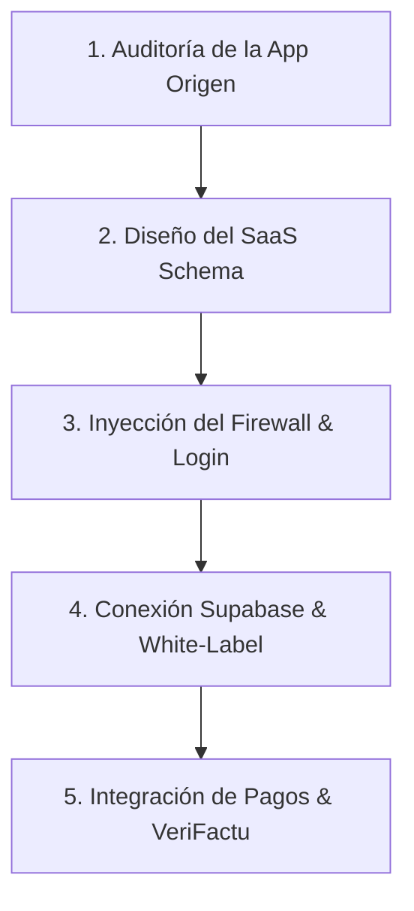

# SaaSify App - Conversor de Web Apps a SaaS de Marca Blanca

Este Skill transforma cualquier aplicación web estática, interactiva o prototipo local en un producto SaaS comercializable bajo una arquitectura multi-tenant de marca blanca, replicando exactamente la estructura, estética premium, seguridad de licencias y pasarelas de **Infinite Coach**.

## Cuándo usar este Skill

- Cuando el usuario quiera empaquetar una aplicación existente (ej. "The Heels" u otra) para venderla como un software bajo licencia.
- Cuando se requiera añadir un flujo de login seguro por clave de licencia sin complicar el backend.
- Cuando desees inyectar una estética oscura premium, base de datos en la nube autogestionada (Supabase) e identidad visual corporativa dinámica.

---

## 1. ARQUITECTURA DE DESTINO (ESTILO INFINITE COACH)

Cualquier aplicación procesada por este Skill debe convertirse a la siguiente arquitectura estructurada de archivos y servicios:

### A. Capa de Autenticación y Licencias (Login)
- **Pantalla de Acceso (`login.html`)**:
  - Estética oscura inmersiva (`#0D0D0F`), orbes de luz desenfocados (`filter: blur(80px)`), cristal esmerilado (`backdrop-filter: blur(15px)`) y tipografía premium (Outfit o Inter).
  - Formulario con campos: **Email** (correo de registro) y **Clave de Licencia / Contraseña** (ej: `HEEL-XXXX-26`).
  - Casilla *"Recordar mis credenciales"* (guarda localmente en `localStorage` con prefijos `_remembered...`).
  - Validación segura en Supabase (con fallback local/Firebase) comparando el registro con la base de datos de licencias.
  - Al conceder acceso, guarda `_trainerAuthed = '1'` en `sessionStorage` y `localStorage`, y almacena el ID del inquilino (`activeTrainerId`).
- **Middleware de Cortafuegos (Firewall)**:
  - Inyección en la cabecera de todas las páginas internas de un script de seguridad instantáneo: si la sesión no está verificada (`localStorage.getItem('_trainerAuthed') !== '1'`), redirige inmediatamente mediante `window.location.href = 'login.html'`.

### B. Capa de Identidad Corporativa Dinámica (Multi-Tenant Branding)
- **Personalización Visual**:
  - Carga en segundo plano de la configuración de marca (`getGlobalConfig` / `BrandConfig`).
  - Inyección automática de colores hexadecimales (Primario, Secundario, Acento) en variables CSS (`:root`) para que la app se pinte con los colores del cliente.
  - Reemplazo dinámico del logotipo y nombre comercial en cabeceras y dashboards.
- **Compresor Canvas de Logotipos**:
  - Inyección de lógica en la subida de archivos del logotipo para redimensionar y comprimir imágenes pesadas a un tamaño estándar de 200x200px JPEG mediante un `<canvas>` oculto antes de subirlas, protegiendo las cuotas de almacenamiento en la nube.

### C. Capa de Sincronización en la Nube (Base de Datos)
- Conexión e inicialización nativa de **Supabase SDK** (con fallback redundante en Firebase/Firestore si la conexión a Supabase falla).
- Lógica de sincronización en segundo plano (`syncFromCloud`) al iniciar sesión o realizar cambios clave.
- Caching defensivo en `localStorage` para garantizar el funcionamiento sin conexión a internet y sincronización diferida al recuperar la cobertura.

### D. Capa Financiera y de Cobros
- **Gestión de Métodos de Pago**:
  - Sección *"Cómo Pagar"* detallando los métodos configurados (Bizum, Transferencia, PayPal o Stripe).
  - Indicación de cobros mediante etiquetas visuales premium: `🔄 RENOVACIÓN AUTOMÁTICA` (suscripción Stripe) o `✋ PAGO MANUAL` (Bizum/Transfer).
  - **Eliminación Segura de Tarjetas**: Botón de borrado instantáneo y permanente para eliminar tarjetas bancarias guardadas en la base de datos del procesador de pagos.
- **Sistema de Facturación Certificada (VeriFactu)**:
  - Generación de facturas de curso legal firmadas digitalmente.
  - Encadenamiento por hash criptográfico (cada factura se firma enlazándose al hash de la anterior, garantizando la inalterabilidad exigida por Hacienda).
  - Código QR interactivo impreso en la factura enlazado a la Sede Electrónica de la Agencia Tributaria.

---

## 2. METODOLOGÍA DE CONVERSIÓN EN 5 PASOS

Cuando este Skill se activa, debes guiar al usuario a través del siguiente flujo de trabajo:

### Paso 1: Auditoría de la App Origen
- Lee los archivos de la aplicación que el usuario desea transformar.
- Identifica los formularios actuales, los scripts y la forma en que almacena datos de forma local.

### Paso 2: Diseño del SaaS Schema
- Diseña la tabla de inquilinos/licencias en Supabase que almacenará el ID de inquilino, Email, Licencia, Vencimiento, Datos Fiscales, Colores HEX de marca y URL del logo.

### Paso 3: Inyección del Firewall & Login
- Crea la pantalla premium de login con el formulario de Licencia (Email/Clave) y el script de validación.
- Coloca el script cortafuegos en la parte superior de todas las pantallas protegidas.

### Paso 4: Conexión Supabase & White-Label
- Configura el servicio de base de datos multi-tenant.
- Reemplaza los colores estáticos de la aplicación por variables CSS inyectadas en vivo en base al perfil del licenciatario.

### Paso 5: Integración de Pagos & VeriFactu
- Inyecta la sección de facturas encadenadas, el código QR tributario y el panel Stripe/Manual con borrado de tarjetas.

---

## 3. FORMATO DE RESPUESTA Y ENTREGA

Al iniciar el proceso de saasificación, presenta siempre al usuario:
1.  **Diagnóstico Inicial**: Qué archivos se van a modificar y crear.
2.  **Plan de Base de Datos**: Estructura de tablas en Supabase para el control de inquilinos y licencias.
3.  **Código del Login y Firewall**: Código completo y elegante de `login.html` listo para usar.
4.  **Propuesta Estética**: Paleta de colores e inyección CSS recomendada para mantener el look premium de Infinite Coach.
5.  **Pruebas de Validación**: Instrucciones para verificar la expiración de licencias, recordar credenciales y validar el borrado de tarjetas.
